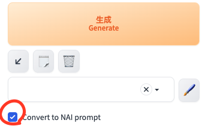

# D2 NAI Prompt Convert

プロンプトに入力した重み指定をNAI方式に変換します。


```
(kawaii:1.2)
👇
{{{{kawaii}}}}
```

### Note
- DynamicPrompts を併用するには A1111 webui 1.7.0 以上が必要です
- DynamicPrompts を使わないなら古いバージョンでも（たぶん）問題ないです


### Installation

1. "Extensions" タブを開く
2. "Install from URL" を開く
3. `https://github.com/da2el-ai/sd-d2-nai-prompt-convert` を "URL of the extension repository" に入力
4. "Install" をクリックしてインストールが完了するのを待つ
5. "Installed" を開き、"Apply and restart the UI" をクリック

### Usage

生成ボタンの下に "Convert to NAI prompt" というチェックボックスがあるので、チェックした状態で生成してください。

[]

